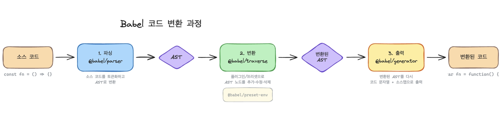
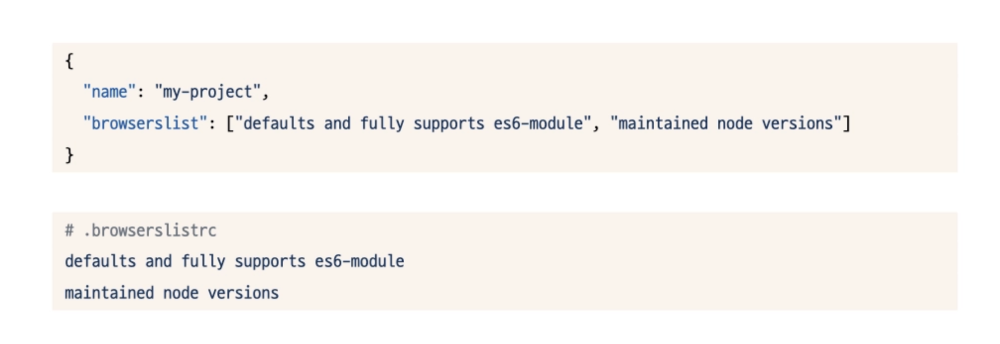

# 5장 트랜스파일과 폴리필
1997년부터 24년까지 정리된 ECMAScript

|  |  |  |
| --- | --- | --- |
| ... | … | 최초버전, 마이너 업데이트 |
| ES3 | 1999 | 정규 표현식(RegExp), try…catch |
| ES5 | 2009 | 엄격 모드(Strict mode, JSON) |
| ES6 | 2015 | 클래스(Classes), 모듈(Modules),화살표 함수(Allow Functions), Promises, let과 const |
| ES7 | 2016 | Array, includes, 거듭제곱 연산자(**) |
| ES8 | 2017 | async와 await, Object.entries, Object.values |
| … | … |  |
| ES13 | 2022 | Top-level await, Public class fields, Error.protype.cause, RegExp match indices(d플래그) |

이런 단계를 거치면서 호환성 문제를 해결하기 위한 트랜스파일과 폴리필이 존재! 

(그럼 24년부터 26년까지는 어떤게 달라졌을까?)

### 더 생각해보기!

- 그냥 async, await이랑 Top-level await이랑 다른점?
    - 이전에는 async로 상단에서 감싸야만 await을 쓸 수 있었다면, Top-level await은 말그대로 최상단 함수에서 await 바로 사용할 수 있다는 것!
        
        ```jsx
        // 이전 버전 
        async function main() {
          const data = await fetch('/api');
        }
        main();
        
        // 요즘 버전
        // Top-level await - ES Module에서 바로 사용, CommonJS에서 안됨
        const data = await fetch('/api');
        console.log(data);
        ```
        
- Public class fields는 class안에 있던 public 키워드와 연관된 문법인건가?
    
    ## Public class fields
    
    Java/TypeScript의 `public` 키워드와는 다르고, **클래스 본문에서 직접 프로퍼티를 선언**할 수 있게 해준 문법.
    
    최신 자바스크립트 기능을 프로젝트에 안전하게 적용하는 방법을 알아보자.
    
    ```jsx
    // 이전 - constructor 안에서만 가능
    class Old {
      constructor() {
        this.name = 'Charlies';
        this.count = 0;
      }
    }
    
    // Public class fields (ES2022) - 바로 선언
    class New {
      name = 'Charlies';
      count = 0;
      // 메서드도 화살표 함수로 바인딩 가능
      handleClick = () => { this.count++; }
    }
    ```
    
    `public` 키워드 없이 그냥 선언하면 public이고, `#`을 붙이면 private field(이것도 ES2022)
    
    ```jsx
    class Example {
      publicField = 1;    // public
      #privateField = 2;  // private - 클래스 외부에서 접근 불가
    }
    ```
    
- 2024~2026 업데이트 살펴보기!
    
    https://pawelgrzybek.com/whats-new-in-ecmascript-2024/
    
    ## ES2024 (ES15) 주요 기능
    
    **1. `Object.groupBy()` / `Map.groupBy()`**
    Lodash 등에서 유명했던 `groupBy`가 드디어 표준이 됨. [pawelgrzybek](https://pawelgrzybek.com/whats-new-in-ecmascript-2024/)
    
    ```jsx
    const langs = [
      { name: "Rust", compiled: true },
      { name: "JavaScript", compiled: false },
      { name: "Go", compiled: true },
    ];
    
    Object.groupBy(langs, ({ compiled }) => compiled ? "compiled" : "interpreted");
    // { compiled: [{Rust}, {Go}], interpreted: [{JavaScript}] }
    ```
    
    **2. `Promise.withResolvers()`**
    Promise 객체와 resolve, reject 메서드를 한번에 꺼낼 수 있는 편의 메서드. [InfoWorld](https://www.infoworld.com/article/2336858/ecmascript-2024-features-you-can-use-now.html)
    
    ```jsx
    const { promise, resolve, reject } = Promise.withResolvers();
    setTimeout(() => resolve("done!"), 1000);
    ```
    
    **3. RegExp `/v` 플래그 (유니코드 세트)**`/u` 플래그의 상위 호환으로, 집합 연산과 유니코드 속성 매칭이 강화됨. [The New Stack](https://thenewstack.io/whats-new-for-javascript-developers-in-ecmascript-2024/)
    
    **4. `String.isWellFormed()` / `String.toWellFormed()`**
    잘못된 UTF-16 서로게이트 쌍을 감지하고 수정하는 메서드.
    
    **5. Resizable ArrayBuffer / `ArrayBuffer.prototype.transfer()`**
    바이너리 버퍼를 생성 후에도 크기 조절하고 소유권을 이전할 수 있게 됐음. [pawelgrzybek](https://pawelgrzybek.com/whats-new-in-ecmascript-2024/)
    
    **6. `Atomics.waitAsync()`**
    워커 스레드 간 안전한 비동기 통신과 동기화를 지원. [InfoWorld](https://www.infoworld.com/article/2336858/ecmascript-2024-features-you-can-use-now.html)
    
    ---
    
    ## ES2025 (ES16) 주요 기능 — 2025년 6월 공식 승인
    
    **1. Iterator Helpers** ⭐
    이터레이터에 `.map()`, `.filter()`, `.take()`, `.drop()` 같은 함수형 연산자가 추가됐어. 배열과 달리 **lazy evaluation**으로 동작해서 대용량 데이터에 성능 이점이 있음. [InfoWorld](https://www.infoworld.com/article/4021944/ecmascript-2025-the-best-new-features-in-javascript.html)
    
    ```jsx
    const arr = ['a', '', 'b', '', 'c', '', 'd'];
    
    arr.values()
      .filter(x => x.length > 0)
      .drop(1)
      .take(2)
      .map(x => `[${x}]`)
      .toArray();
    // ['[b]', '[c]']
    ```
    
    **2. Set 메서드** ⭐
    수학적 집합 연산이 내장됨 [2ality](https://2ality.com/2025/06/ecmascript-2025.html)
    
    ```jsx
    const a = new Set([1, 2, 3]);
    const b = new Set([2, 3, 4]);
    
    a.union(b);        // Set {1, 2, 3, 4}
    a.intersection(b); // Set {2, 3}
    a.difference(b);   // Set {1}
    a.isSubsetOf(b);   // false
    ```
    
    **3. Import Attributes (JSON Modules)**
    JS가 아닌 리소스를 import할 때 타입을 명시할 수 있게 됨. [2ality](https://2ality.com/2025/06/ecmascript-2025.html)
    
    ```jsx
    import config from './config.json' with { type: 'json' };
    ```
    
    **4. `Promise.try()`**
    동기/비동기 함수를 안전하게 Promise 체인에 넣을 수 있는 메서드. [Saeloun Blog](https://blog.saeloun.com/2025/07/08/new-features-in-ecmascript-2025/)
    
    ```jsx
    Promise.try(() => possiblySync())
      .then(result => process(result))
      .catch(err => handle(err));
    ```
    
    **5. `RegExp.escape()`**
    정규식 특수문자를 안전하게 이스케이프해줌. [2ality](https://2ality.com/2025/06/ecmascript-2025.html)
    
    ```jsx
    RegExp.escape("[*]");  // "\\[\\*\\]"
    ```
    
    **6. RegExp 패턴 모디파이어 (인라인 플래그)**
    정규식의 일부분에만 플래그를 적용할 수 있음.
    
    **7. Duplicate Named Capture Groups**
    정규식의 서로 다른 브랜치에서 같은 이름의 캡처 그룹을 쓸 수 있게 됨. [The New Stack](https://thenewstack.io/whats-new-for-javascript-developers-in-ecmascript-2024/)
    
    **8. Float16Array**
    반정밀도(16비트) 부동소수점 배열이 추가됐어. GPU나 ML 작업에서 메모리 절약에 유용. [Saeloun Blog](https://blog.saeloun.com/2025/07/08/new-features-in-ecmascript-2025/)
    
    ---
    
    ES2026은 아직 공식 확정 전이지만, **Decorators**, **Temporal API** (Date 대체), **Pattern Matching** 등이 Stage 3~4에서 진행 중이라고 함
    
    > Node.js개발할떄, Iterator Helpers나 Set 메서드 활용해보기
    

## 트랜스파일을 도와주는 도구, 바벨

- 바벨(babel) 최신 자바스크립트 코드를 구형 브라우저와 호환되는 코드로 변환하는 데 사용되는 대표적인 트랜스파일러,
- 바벨은 구형 브라우저와 빠르게 진화하는 자바스크립트와의 간극을 매우는 역할을 함
- 바벨 등장 전에 사용하던 도구 : Traceur, es6-shim(구글에서 개발한 도구)
- 그러나.! 2014년 세바스찬 맥켄지의 6to5라는 이름으로 바벨이 첫 등장을 함!
    - 초기에는 es6 → es5로 트랜스파일해서 구형 브라우저에서도 최신 자바스크립트 기능을 사용할 수 있도록 하는 것에 그침
    - 이후 바벨의 이름이됨
    
    <aside>
    👤
    
    맥켄지 : “이름이 es6에 관한 것으로만 암시한다는 피드백을 받고 babel이라는 이름으로 변경하겠슴다”
    
    </aside>
    

> 바벨 이름의 유래 - 더글러스 애덤스의 “은하수를 여행하는 히치하ㅣㅇ커를 위한 안내서” → 다른 언어를 자동으로 번역하는 물고기인 바벨 피시(babel fish)에서 따온 바벨을 babel로 사용 시작! → 또 다른 의미는 바벨탑 이야기의 바벨을 참고함.
> 

지금도 꼭 바벨이 필수적일까? 

- 지금은 vite, esbuild 같은 도구들이 등장함에 따라 빠른 빌드가 필요하다면 babel을 꼭 사용하지 않아도 좋지만 안정성은 오랜기간 존재해온 babel을 추천함
- 목적에 따를 것!
    - 구형 브라우저에도 동작해야한다면 babel
    - 최신 브라우저 대상이라면 vite나 esbuild추천

### 바벨의 특징

- 플러그인 시스템
- ES6를 넘어 광범위한 자바스크립트 문법 지원
- 여러 플러그인을 쉽게 설정할 수 있는 프리셋 제공
    - `@babel/preset-react`, `@babel/preset-env` , `@babel/preset-typescript` , `@babel/preset-flow`
- 활발한 커뮤니티 지원 → 많은 개발자들의 기여와 피드백을 통해 빠르게 성정 발전할 수 있었음 , 현재도 활발하게 운영되며 빠른 업데이트와 새로운 기능 추가가 이뤄지고 있음.

### 바벨의 동작 방식

- 추상 구문 트리( Abstract Syntax Tree )
    - 노드(Node) : 트리의 각 요소를 나타내며, 주로 변수나 함수 선언문 등 코드의 구문 요소를 의미하는 기본 단위
    - 자식 노드(child node) : 특정 노드의 하위 요소로 해당 구문 요소의 세부 항목을 포함한다. 예를 들어, 함수 선언문의 경우, 함수명이나 파라미터, 함수 블록의 내용 등을 자식 노드로 표현한다.
    - 최상위 노드 (root node): 트리의 최상위 노드로, 일반적으로 전체 프로그램이나 코드 블록을 나타낸다.

```jsx
const sum = (a, b) => a + b
```

- https://astexplorer.net/
- 파싱해서 JSON 객체로 트리로 표현됨
- 추상 구문 트리 파서란 무엇인가요?
    - 자바스크립트 코드를 파싱해서 추상 구문 트리 자료구조로 변환하는 도구를 자바스크립트 추상 구문 트리 파서라고 함
- 바벨이 코드 변환하는 과정 `@babel/core` = `@babel/parser` + `@babel/traverse` + `@babel/generator`
- 



- 바벨 사용해보기!

## 폴리필을 도와주는 도구 core-js

- core-js란 무엇인가?
    - 바벨에서 변환된걸 다른 브라우저에서 쓸 수 있게 바꿔주는 도구
    - 데니스 푸슈카레프가 만든 폴리필 라이브러리
    - 모듈화가 잘돼있어서 필요한 기능만 선택적으로 로드할 수 있음
- 바벨과 core-js
    - core-js는 일반적을오 바벨의 트랜스파일 기능과 함께 사용함.
    - 바벨은 core-js를 의존성으로 포함해서 프리셋과 플러그인에서 폴리필 기능을 설정할 수 있음

## 최선의 폴리필과 트랜스파일은 무엇일까?

- 지원 환경 명시하기!
    - 폴리필과 트랜스파일러에 영향을 미치는 주요한 요인은 지원해야 하는 브라우저 범위와 Node.js 버전 범위다. 프로젝트가 목표로 하는 브라우저를 명확히 하면 불필요한 폴리필과 트랜스파일을 줄일 수 있어 번들 크기를 최소화할 수 있음.
    - 범위를 명시하는 방법 : browerslist
- browerslist
    - 다양한 프런트엔드 도구들이 공통된 브라우저 및 Node.js 버전 설정을 공유할 수 있게 해주는 도구
    - 바벨 : `@babel/preset-env` 는 browserslist 설정을 참고해서 폴리필과 변환을 적용함
    - ESLint : `eslint-plugin-compat` 플러그인은 browserslist설정을 사용해서 특정 브라우저에서 지원되지 않는 기능을 감지 후 개발자에게 경고를 알림. 자바스크립트 코드 품질과 스타일을 검사하는 도구로 바벨과 유사하게 플러그인 방식으로 동작함
    - Autoprefixer : postcss의 Autoprefixer는 CSS 코드에 필요한 브라우저 접두사를 자동으로 추가해주는 도구로 browserslist 설정을 사용해서 지원하려는 브라우저에 맞춰 접두사를 추가함
        
        ```jsx
        display: -ms-flexbox;
        ```
        
- browerslist 설정방법
    - browserslist 필드나 .browserslistrc라는 별도의 구성 파일을 생성해서 관리.
- 예시
    
    
    
- .browserslistrc에는 시장 점유율 기준, 최신 버전 기준, 정확한 버전 지정, 브라우저가 지원하는 기능 기준, 유지보수 상태, Node.js버전, 기본 설정 등 쿼리를 사용해서 기준을 정할 수 있음 → 이때 하나만 사용하는 것보다 여러 개 쿼리를 조합해서 사용하는 것이 더 정확함.
- 지원 범위 선정 기준 → 어느 범위까지 지정해야할까?
    - 사용자 기반 , 프로젝트 성격과 요구사항, 브라우저 및 Node.js의 최신 기능 활용 여부, 사용 중인 프레임워크 및 라이브러리

## 바벨과 core-js의 대안

- 타입스크립트 컴파일러
- swc (speedy web compiler) : 러스트로 개발된 고성능 트랜스파일러 → 빠른 속도 → 대규모 프로젝트 빠른 트랜스파일 가능
- es-shims : 레거시 환경 지원에 최적화됨 → 안정적이고 검증된 기능의 폴리필에 초점을 맞춤
- polyfill.js : core-js와 유사항 폴리필 라이브러리 → core-js와 차이점은 폴리필을 로드하는 방식이 다름 → 현재 브라우저가 해당 기능을 지원하는지 감지하는 방식이 다름,
    - core-js는 es-shims를 소개할 때 설명한 것처럼 코드 내부에 현재 실행되는 브라우저가 기능을 제공하는지 판단해서 폴리필 삽입
    - polyfill.js는 User-agent기반으로 브라우저기능을 감지해 필요한 폴리필을 결정하는 방식으로 기능 감지가 이뤄짐
- [polyfill.io](http://polyfill.io) 공급망 공격이슈 → Polyfill.js 사용하던 서비스에서 2024년 2월에 장애가 남.